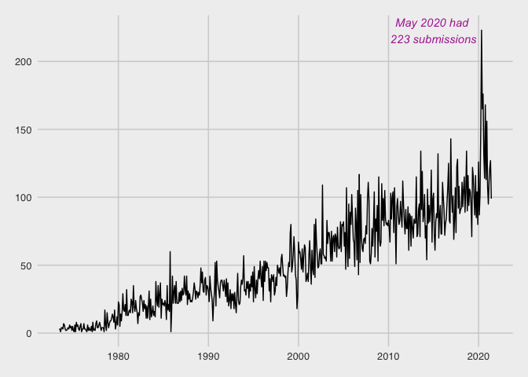
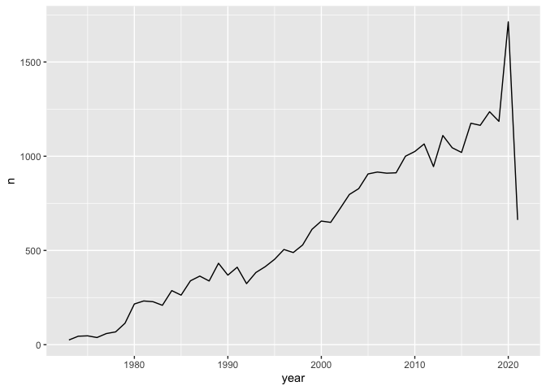
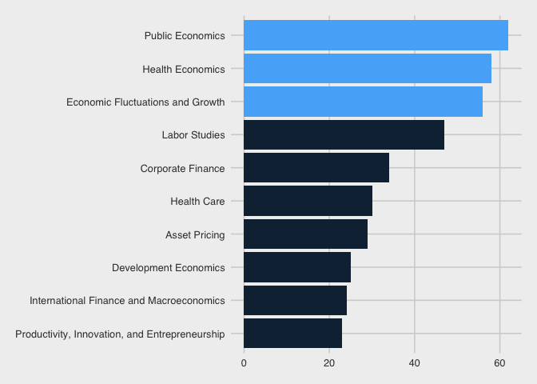
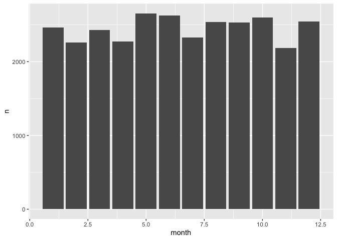

``` r
head(authors)
```

    ## # A tibble: 6 x 4
    ##   author  name             user_nber        user_repec
    ##   <chr>   <chr>            <chr>            <chr>     
    ## 1 w0001.1 Finis Welch      finis_welch      <NA>      
    ## 2 w0002.1 Barry R Chiswick barry_chiswick   pch425    
    ## 3 w0003.1 Swarnjit S Arora swarnjit_arora   <NA>      
    ## 4 w0004.1 Lee A Lillard    <NA>             pli669    
    ## 5 w0005.1 James P Smith    james_smith      psm28     
    ## 6 w0006.1 Victor Zarnowitz victor_zarnowitz <NA>

``` r
tail(authors)
```

    ## # A tibble: 6 x 4
    ##   author  name                    user_nber          user_repec
    ##   <chr>   <chr>                   <chr>              <chr>     
    ## 1 h0122.1 Carolyn M Moehling      carolyn_moehling   pmo729    
    ## 2 h0127.2 Zeynep Kocabiyik Hansen zeynep_hansen      <NA>      
    ## 3 h0131.2 Ruth Dupre              <NA>               <NA>      
    ## 4 h0131.3 Tomas Nonnenmacher      tomas_nonnenmacher <NA>      
    ## 5 h0132.2 Leonard Caruana         <NA>               <NA>      
    ## 6 h0137.1 Howard Bodenhorn        howard_bodenhorn   <NA>

Use `papers` data set to create dataviz

``` r
papers %>% 
  ggplot(aes(x = year)) +
  geom_bar()
```



``` r
year_count <- papers %>% 
  count(year)
```

``` r
year_count
```

    ## # A tibble: 49 x 2
    ##     year     n
    ##  * <dbl> <int>
    ##  1  1973    25
    ##  2  1974    45
    ##  3  1975    47
    ##  4  1976    38
    ##  5  1977    59
    ##  6  1978    68
    ##  7  1979   114
    ##  8  1980   216
    ##  9  1981   232
    ## 10  1982   228
    ## # … with 39 more rows

``` r
papers %>% 
  count(year) %>% 
  ggplot(aes(x = year, y = n)) +
  geom_line()
```



``` r
papers %>% 
  count(year, month) %>% 
  mutate(date = as.Date(paste(year, month, "01", sep = "-"))) %>% 
  ggplot(aes(x = date, y = n)) +
  geom_line()
```



``` r
papers %>% 
  count(month)
```

    ## # A tibble: 12 x 2
    ##    month     n
    ##  * <dbl> <int>
    ##  1     1  2465
    ##  2     2  2259
    ##  3     3  2431
    ##  4     4  2277
    ##  5     5  2654
    ##  6     6  2626
    ##  7     7  2325
    ##  8     8  2539
    ##  9     9  2532
    ## 10    10  2598
    ## 11    11  2185
    ## 12    12  2543

``` r
papers %>% 
  count(month) %>% 
  ggplot(aes(x = month, y = n)) +
  geom_bar(stat = "identity")
```


