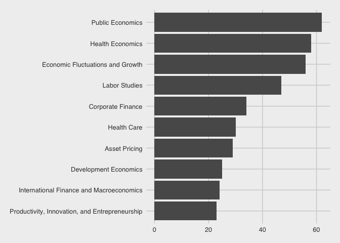
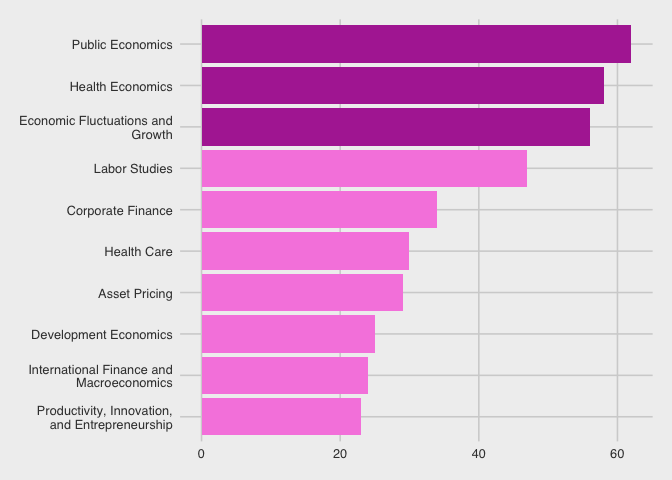
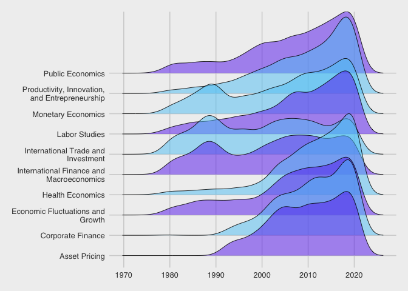

## Visualization of monthly NBER paper submission

Anecdotally I had heard that many economists were submitting tons of
papers to NBER during the Covid-19 pandemic. However, it was not clear
to me whether this was a trend or a flash in the pan. The following
visualization show that the spike in 2020 was primarily in one month.

``` r
papers %>% 
  count(year, month) %>% 
  mutate(date = as.Date(paste(year, month, "01", sep = "-"))) %>% 
  ggplot(aes(x = date, y = n)) +
  geom_line(size = 0.3) 
```


Which month saw the spike? This table shows that it was in May 2020. Top
6 months with highest submissions are in 2020.

``` r
papers %>% 
  count(year, month, sort = TRUE) %>% 
  head(10)
```

    ## # A tibble: 10 x 3
    ##     year month     n
    ##    <dbl> <dbl> <int>
    ##  1  2020     5   223
    ##  2  2020     7   176
    ##  3  2020    10   168
    ##  4  2020     6   165
    ##  5  2020    12   156
    ##  6  2020     4   152
    ##  7  2016    12   143
    ##  8  2013     8   134
    ##  9  2018     9   134
    ## 10  2015     7   132

Let’s annotate the earlier plot with the spike in may 2020.

``` r
papers %>% 
  count(year, month) %>% 
  mutate(date = as.Date(paste(year, month, "01", sep = "-"))) %>% 
  ggplot(aes(x = date, y = n)) +
  geom_line(size = 0.3) +
  annotate(geom = "text", x = as.Date("2015-01-01"), y = 223, 
           label = "May 2020 had \n223 submissions", color = "#b131a2", fontface = "italic")
```


## Sub-areas of Economics submitting in May 2020

Next, let’s visualize the top subcategories submitting in May 2020. I
expected these to be from Heath Care and Heath Economics. But is that
the case?

Create a merged data set with `papers` and `programs`

``` r
papers_merged <- papers %>% 
  left_join(paper_programs, by = "paper") %>% 
  left_join(programs, by = "program")
```

``` r
top_10_may_2020 <- papers_merged %>% 
  filter(year == 2020 & month == 5) %>% 
  count(program_desc, sort = TRUE) %>% 
  head(10)
```

``` r
top_10_may_2020
```

    ## # A tibble: 10 x 2
    ##    program_desc                                       n
    ##    <chr>                                          <int>
    ##  1 Public Economics                                  62
    ##  2 Health Economics                                  58
    ##  3 Economic Fluctuations and Growth                  56
    ##  4 Labor Studies                                     47
    ##  5 Corporate Finance                                 34
    ##  6 Health Care                                       30
    ##  7 Asset Pricing                                     29
    ##  8 Development Economics                             25
    ##  9 International Finance and Macroeconomics          24
    ## 10 Productivity, Innovation, and Entrepreneurship    23

``` r
top_10_may_2020 %>% 
  ggplot(aes(x = reorder(program_desc, n), y = n )) +
  geom_col() +
  coord_flip() 
```



Let’s fill the first 3 bars with a different color. Also, using
`str_swap` function from `sringr` package (bundled with `tidyvere` so
you don’t have to install it separately) wrap the axis labels.

``` r
top_10_may_2020 %>% 
  mutate(top3 = ifelse(n >= 56, 1, 0)) %>% 
  ggplot(aes(x = reorder(program_desc, n), y = n )) +
  geom_col(aes(fill = as.factor(top3)), show.legend = FALSE) +
  coord_flip() +
  scale_fill_manual(values = c("#f78ae0", "#b131a2")) +
  scale_x_discrete(labels = function(x) str_wrap(x, width = 25))
```



How does the distribution of the top 10 most submitted program
descriptions look like? First, get the top 10 most popular programs of
all times.

``` r
top_10 <-  papers_merged %>% 
  count(program_desc, sort = TRUE) %>%  
  head(10)
```

We can compare individual distributions using `facet_wrap`. But there is
a better way to compare these distributions over time using `ggridges`
package.

``` r
papers_merged %>% 
  inner_join(top_10, by = "program_desc") %>% 
  ggplot(aes(x = year, y = program_desc, fill = program)) +
  geom_density_ridges(scale = 4, alpha = 0.5, size = 0.3) + 
  scale_fill_cyclical(values = c("#6638f0", "#5cc9f5")) +
  scale_y_discrete(labels = function(x) str_wrap(x, width = 25))
```

    ## Picking joint bandwidth of 1.77



Although almost all the top-10 fields experienced increases in 2020
submissions, International Trade and Finance related submissions were
flat. Corporate Finance submissions saw a sharper bump compared to Asset
Pricing, which both belong to Finance.
