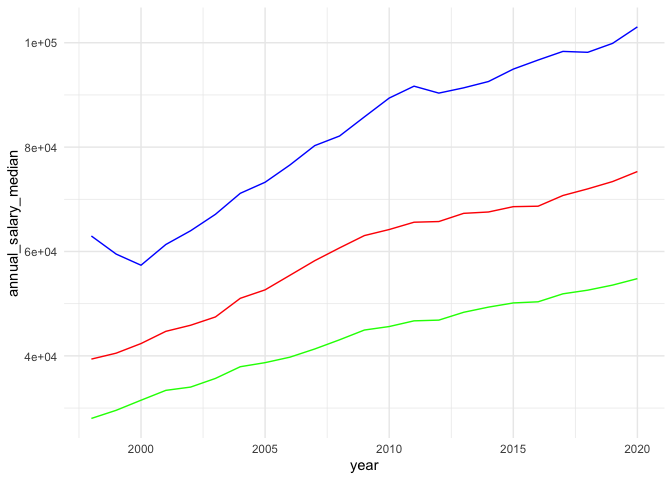
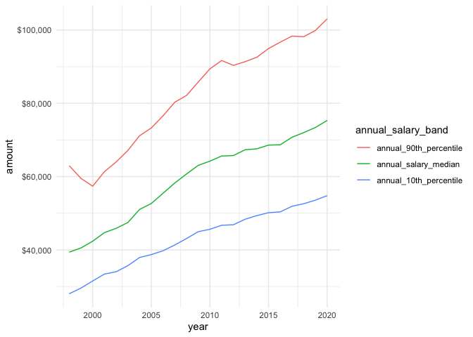
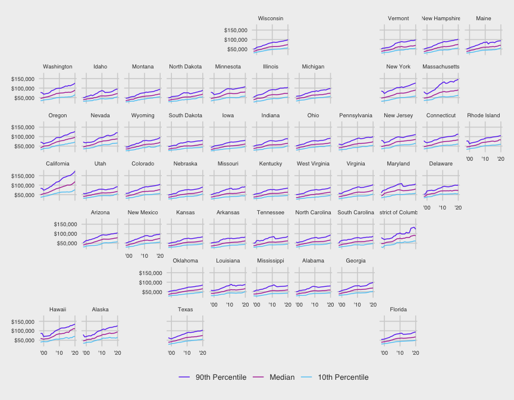

install.packages(“janitor”)

``` r
nurses <- readr::read_csv('https://raw.githubusercontent.com/rfordatascience/tidytuesday/master/data/2021/2021-10-05/nurses.csv') %>% 
  janitor::clean_names()
```

    ## 
    ## ── Column specification ────────────────────────────────────────────────────────
    ## cols(
    ##   .default = col_double(),
    ##   State = col_character()
    ## )
    ## ℹ Use `spec()` for the full column specifications.

``` r
nurses %>% 
  count(year)
```

    ## # A tibble: 23 x 2
    ##     year     n
    ##  * <dbl> <int>
    ##  1  1998    54
    ##  2  1999    54
    ##  3  2000    54
    ##  4  2001    54
    ##  5  2002    54
    ##  6  2003    54
    ##  7  2004    54
    ##  8  2005    54
    ##  9  2006    54
    ## 10  2007    54
    ## # … with 13 more rows

``` r
nurses %>% 
  count(state)
```

    ## # A tibble: 54 x 2
    ##    state                    n
    ##  * <chr>                <int>
    ##  1 Alabama                 23
    ##  2 Alaska                  23
    ##  3 Arizona                 23
    ##  4 Arkansas                23
    ##  5 California              23
    ##  6 Colorado                23
    ##  7 Connecticut             23
    ##  8 Delaware                23
    ##  9 District of Columbia    23
    ## 10 Florida                 23
    ## # … with 44 more rows

``` r
names(nurses)
```

    ##  [1] "state"                                       
    ##  [2] "year"                                        
    ##  [3] "total_employed_rn"                           
    ##  [4] "employed_standard_error_percent"             
    ##  [5] "hourly_wage_avg"                             
    ##  [6] "hourly_wage_median"                          
    ##  [7] "annual_salary_avg"                           
    ##  [8] "annual_salary_median"                        
    ##  [9] "wage_salary_standard_error_percent"          
    ## [10] "hourly_10th_percentile"                      
    ## [11] "hourly_25th_percentile"                      
    ## [12] "hourly_75th_percentile"                      
    ## [13] "hourly_90th_percentile"                      
    ## [14] "annual_10th_percentile"                      
    ## [15] "annual_25th_percentile"                      
    ## [16] "annual_75th_percentile"                      
    ## [17] "annual_90th_percentile"                      
    ## [18] "location_quotient"                           
    ## [19] "total_employed_national_aggregate"           
    ## [20] "total_employed_healthcare_national_aggregate"
    ## [21] "total_employed_healthcare_state_aggregate"   
    ## [22] "yearly_total_employed_state_aggregate"

``` r
nurses %>% 
  filter(state == "Texas") %>% 
  ggplot(aes(x = year)) +
  geom_line(aes(y = annual_salary_median), color = "red") +
  geom_line(aes(y = annual_90th_percentile), color = "blue") +
  geom_line(aes(y = annual_10th_percentile), color = "green") +
  theme_minimal()
```



``` r
nurses %>% 
  filter(state == "Texas") %>% 
  select(year, annual_salary_median, annual_90th_percentile, annual_10th_percentile) %>% 
  tidyr::pivot_longer(
    cols = c(annual_salary_median, annual_90th_percentile, annual_10th_percentile),
    names_to = "annual_salary_band",
    values_to = "amount") %>% 
  mutate(annual_salary_band = factor(annual_salary_band,
                                     levels = c("annual_90th_percentile",
                                                "annual_salary_median",
                                                "annual_10th_percentile"))) %>% 
  ggplot(aes(x = year, y = amount, color = annual_salary_band)) +
  geom_line() +
  scale_y_continuous(labels = scales::dollar) +
  theme_minimal()
```



## Create a geofacet

Let’s first create a data set for making the geo facet plot

``` r
nurses_geo <- nurses %>% 
  filter(!state %in% c("Guam", "Puerto Rico", "Virgin Islands")) %>% 
  select(year, state, annual_salary_median, annual_90th_percentile, annual_10th_percentile) %>% 
  tidyr::pivot_longer(
    cols = c(annual_salary_median, annual_90th_percentile, annual_10th_percentile),
    names_to = "annual_salary_band",
    values_to = "amount") %>% 
  mutate(annual_salary_band = factor(annual_salary_band,
                                     levels = c("annual_90th_percentile",
                                                "annual_salary_median",
                                                "annual_10th_percentile")))
```

Print out and see how this data set looks:

``` r
head(nurses_geo)
```

    ## # A tibble: 6 x 4
    ##    year state   annual_salary_band     amount
    ##   <dbl> <chr>   <fct>                   <dbl>
    ## 1  2020 Alabama annual_salary_median    58630
    ## 2  2020 Alabama annual_90th_percentile  80420
    ## 3  2020 Alabama annual_10th_percentile  43150
    ## 4  2020 Alaska  annual_salary_median    94070
    ## 5  2020 Alaska  annual_90th_percentile 126260
    ## 6  2020 Alaska  annual_10th_percentile  65530

``` r
ggplot(nurses_geo, aes(x = year, y = amount, color = annual_salary_band)) +
  geom_line() +
  facet_geo(~ state) +
  theme_minimal() +
  labs(x = NULL, y = NULL, color = NULL) +
  scale_color_manual(values = c("#6638f0", "#b131a2", "#5cc9f5"), 
                     labels = c("90th Percentile", "Median", "10th Percentile")) +
  scale_y_continuous(labels = scales::dollar) +
  scale_x_continuous(breaks = c(2000, 2010, 2020), 
                     labels = c("'00", "'10", "'20")) +
  ggthemes::theme_fivethirtyeight() +
  theme(strip.text = element_text(size = 7),
        axis.text = element_text(size = 7))
```



I saved this picture for future use.

``` r
ggsave(here::here("2021-10-08-nurses", "geo_facet.png"), 
       width = 10, height = 6, dpi = 600)
```
